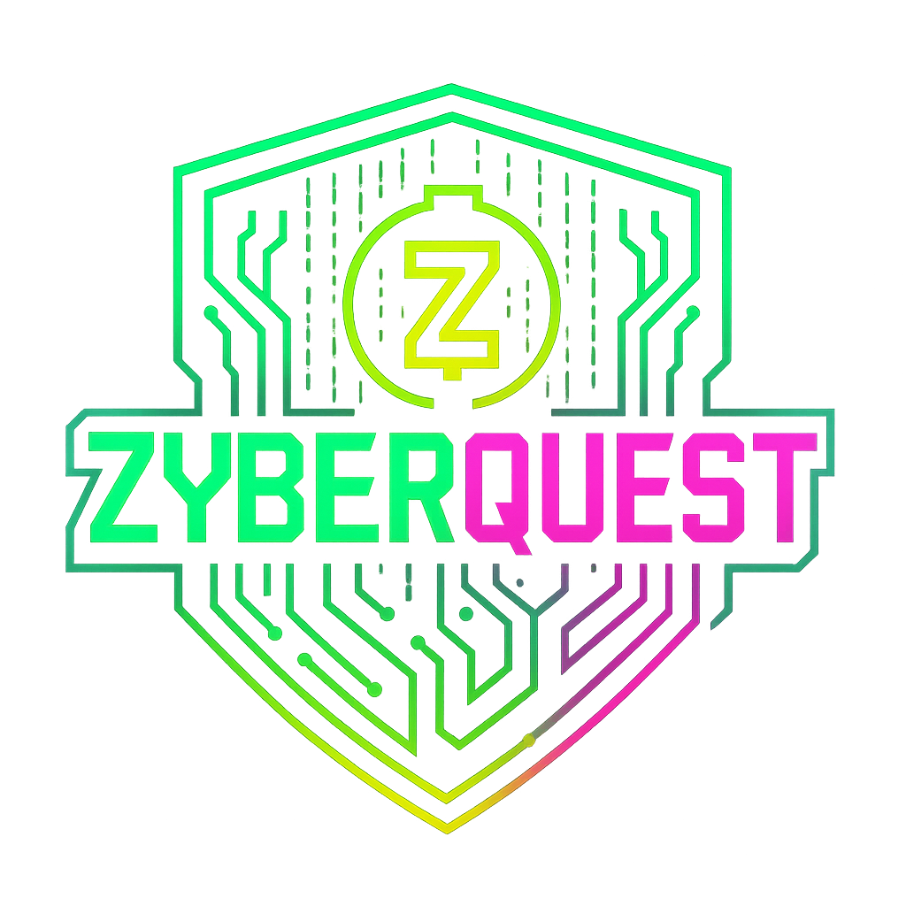

# 🕹️ ZyberQuest — Cypherpunk Arcade

> Connect nodes. Break ciphers. Master the maze.  
> An off-chain arcade game to learn privacy, ZK, and encryption with a neon, Matrix-like vibe.

<p align="center">
  
</p>

<div align="center">

[**Live Demo**](#)

</div>

---

## ✨ Overview

ZyberQuest is a **2D cypherpunk arcade** with three replayable modes:

- **Educational Trivias** — Learn Zcash/privacy/ZK concepts with bite-size tooltips.  
- **Exploration Mazes** — Top-down Phaser-powered levels with doors, keys, hazards, and portals.  
- **Cipher Simulators** — Mini game (**Visual XOR**) with three difficulty modes to “decrypt” messages.

---

## 🧭 Table of Contents

- [Features](#-features)  
- [Tech Stack](#-tech-stack)  
- [Design System](#-design-system)  
- [Accessibility](#-accessibility)  
- [Repository Structure](#-repository-structure)  
- [App Routes & Flows](#-app-routes--flows)  
- [Game Modes](#-game-modes)  
  - [Trivias (Zcash Privacy Arcade)](#trivias-zcash-privacy-arcade)  
  - [Laberintos (Exploration Mazes)](#laberintos-exploration-mazes)  
  - [Simulators — Visual XOR](#simulators--visual-xor)  
- [Getting Started](#-getting-started)  
- [Environment Variables](#-environment-variables)  
- [Scripts](#-scripts)  
- [Development Guide](#-development-guide)  
- [Testing & Quality](#-testing--quality)  
- [Roadmap](#-roadmap)  
- [License](#-license)  
- [Team & Credits](#-team--credits)

---

## 🚀 Features

- **Replayable**: Randomized questions/levels, difficulty presets, persistent highscores.  
- **Educational**: Tooltips (“Why?”), micro-capsules, and in-game portals explaining ciphers.  
- **Fluid UX**: 60 FPS targets, responsive layout, keyboard shortcuts everywhere.  
- **Inclusive**: High contrast, visible focus, reduced-motion support, ARIA labels.  
- **Production-ready**: Strong typing (TS/Zod), modular state (Zustand), clean file layout.

---

## 🛠 Tech Stack

- **Framework**: Next.js 14 (App Router), TypeScript  
- **UI/Styling**: Tailwind CSS (custom tokens), shadcn/ui, Radix UI  
- **Animation**: Framer Motion (respects `prefers-reduced-motion`)  
- **Game Engine (Mazes)**: Phaser 3 (Arcade Physics)  
- **State**: Zustand (lightweight, predictable)  
- **Validation**: Zod (schema-first content)  
- **Icons/Fonts**: Lucide React, Inter + IBM Plex Mono via `next/font`  
- **SEO**: Next Metadata API, `next-sitemap` for `sitemap.xml`/`robots.txt`

---

## 🎨 Design System

**Color tokens** (in `globals.css`):

```bash
:root {
  --zx-green:   #00FF9C;  /* primary */
  --zx-cyan:    #00E5FF;  /* secondary */
  --zx-yellow:  #F4B728;  /* Zcash accent */
  --zx-magenta: #FF3DBE;  /* alerts/glitches */
  --zx-ink:     #0A0D0A;  /* deep bg */
  --zx-mid:     #0E1A16;  /* panels */
  --zx-grid:    rgba(0,255,156,0.08); /* ornaments */
```

- Fonts: Inter (UI), IBM Plex Mono (headings/monospace).
- Effects: Subtle scanline overlay, neon borders, optional code-rain particles.
- Layout: Grid-based cards, soft shadows, generous spacing.

## ♿ Accessibility

- Visible focus outlines; keyboard navigation across all controls.
- Shortcuts: documented per mode (numbers, Enter/Space, Esc, P, arrows/WASD).
- Reduced motion: fallbacks for intro/menu and micro-interactions.
- ARIA & labels: tooltips, timers, and interactive elements are labeled and announced.

## 📂 Repository Structure

```bash
zyberquest/
├─ app/
│  ├─ intro/page.tsx                 # Animated intro → /menu
│  ├─ menu/page.tsx                  # Main mode selector (3 cards)
│  ├─ trivias/page.tsx               # Trivia mode mount
│  ├─ laberintos/
│  │  ├─ page.tsx                    # Mode intro + Caesar capsule
│  │  └─ play/page.tsx               # Phaser mount (Tutorial/Mission)
│  ├─ simulators/page.tsx            # Simulators intro → Visual XOR
│  ├─ api/                           # (if needed later)
│  ├─ layout.tsx, globals.css, sitemap.ts, robots.ts
│  └─ providers.tsx                  # UI providers if required
│
├─ components/
│  ├─ Intro/                         # CodeRain, Logo, Typewriter, MuteToggle...
│  ├─ Menu/                          # ModeCard, ModeGrid, MenuLayout...
│  ├─ Trivia/                        # TriviaScreen, QuestionCard, SummaryModal...
│  ├─ Simulators/                    # XORGrid, HUD, Summary...
│  └─ UI/                            # Buttons, Cards, HUD bits
│
├─ game/labyrinth/
│  ├─ index.ts                       # createPhaserGameWithMode / destroy
│  ├─ config.ts                      # Phaser.GameConfig
│  ├─ scenes/
│  │  ├─ Boot.ts, Preload.ts
│  │  ├─ LabPlay.ts                  # Core maze logic
│  │  ├─ PortalMiniGame.ts           # Caesar portal
│  │  ├─ HUD.ts, PauseOverlay.ts, Results.ts
│  └─ systems/                       # collisions, controls, drones, lasers, portals, minimap
│
├─ store/
│  ├─ triviaStore.ts                 # state, scoring, persist
│  └─ simStore.ts                    # Visual XOR state
│
├─ lib/
│  ├─ triviaSchema.ts, triviaLoader.ts
│  ├─ simGenerators.ts, xorSchema.ts
│  └─ a11y.ts, sfx.ts (optional)
│
├─ data/
│  ├─ trivia-zcash.json              # Question bank (Zod-validated)
│  └─ nodes.json                     # Maze micro-capsules (2–3 lines each)
│
├─ public/
│  ├─ runner/runner-{f|m}.png        # Characters
│  ├─ laberintos/char-{f|m}.png
│  ├─ sfx/                           # optional SFX
│  └─ og/zyberquest-banner.png
│
├─ .env.example
├─ package.json, tsconfig.json, next.config.js, tailwind.config.js
└─ README.md
```

---

## 🧩 App Routes & Flows

Global flow (Intro → Menu → Modes):

```bash
┌──────────┐
│  /intro  │  type-in + code-rain (skip: Esc)
└────┬─────┘
     v
┌──────────┐
│  /menu   │  choose [1]Trivia [2]Mazes [3]Simulators
└─┬───┬───┬┘
  v   v   v
 /trivias  /laberintos  /simulators

```

Keyboard: 1/2/3 to select · Enter/Space to open · Esc back · M mute toggle.
---

## 🎮 Game Modes

## Trivias (Zcash Privacy Arcade)

- Play: /trivias → Intro (difficulty + explainer) → 10 shuffled questions → Summary.
- Difficulty: Beginner (35s/Q), Intermediate (30s), Advanced (25s).
- Scoring: Streak multiplier (1.00 / 1.10 / 1.25).
- Persistence:
1. zyberquest_trivia_record (high score)
2. zyberquest_trivia_history (last 10 runs)

Hotkeys: 1–4 select option · Enter confirm/next · P pause · Esc back.

Data schema (src/lib/triviaSchema.ts):
```bash
export type TriviaQuestion = {
  id: string;
  category: string;
  type: "mcq";
  question: string;
  choices: [string, string, string, string];
  answerIndex: number; // index into choices
  explain: string;     // 1–3 lines
  difficulty: "Beginner" | "Intermediate" | "Advanced";
  tags?: string[];
};
```

Add questions: edit src/data/trivia-zcash.json (validated by Zod).
UI: Radix Tooltip “Why?”, decrypt-glow (correct) / glitch-shake (wrong), neon panel.

-

## Laberintos (Exploration Mazes)

- Play: /laberintos (mode picker + “Caesar Capsule”)
1. /laberintos/play?mode=tutorial — sandbox, keys/door, portal demo (“SHIELD”).
2. /laberintos/play?mode=mission — timed run with keys, portal (“PRIVACY”), laser, slow zone, drone, exit.

**Controls**: WASD/Arrows move · E interact · Space dash (3s CD) · P pause · Esc menu
**HUD**: countdown, keys, score, minimap (events: hud:minimap:init, hud:minimap:update)

**Maps & tiles**: JSON from Tiled (16×16 or 32×32).
Layers: floors, walls (index 1 collides), door tile index 2 (opens → set to 0).
Laser toggles every ~900ms; slow zones reduce speed to 60%; drone patrol via waypoints array.

**Educational nodes**: src/game/labyrinth/data/nodes.json (2–3 lines each).
**Performance**: 60 FPS targets; scene‐local timers/tweens cleaned on restart; minimal collisions.

-

## Simulators — Visual XOR

- Play: /simulators → Intro (difficulty + explainer) → Visual XOR → Summary.
- Objective: Illuminate all letter cells (A XOR B).
- Grades:
1. Perfect Clean (100%) — letters on & background clean.
2. Decrypted (70%) — all letters on, extra cells allowed.
- Difficulties:
1. Easy → “ZC” (16×8, 90s)
2. Medium → “ZEC” (24×12, 75s)
3. Hard → “ZCASH” (32×16, 60s)

**Scoring**: 100 + (timeLeft * 2) then × 1.0 (Perfect) or 0.7 (Decrypted) + streak * 10.
**Hints**: reveal a correct row (−10 pts).
**State (Zustand)**: start, decreaseTime, solve, endRound, useHint, reset (persist last 10 runs + high score).
**Add words**: extend 5×5 glyphs or rasterize custom text in lib/simGenerators.ts.
**A11y**: focus ring per cell, aria-label per grid cell, keyboard navigation (arrows, Space/Enter, P, Esc).

---

## 🧑‍💻 Getting Started

Prerequisites
```bash
Node.js 20+ and npm 10+

Git, a modern browser with WebGL (for Phaser)

Install & Run
# clone
git clone https://github.com/your-username/zyberquest
cd zyberquest

# install deps
npm install

# dev server
npm run dev
# → http://localhost:3000


Build & start:

npm run build
npm start
```

---

## 📦 Scripts

```bash
npm run dev — Start Next dev server

npm run build — Production build

npm run start — Run production server

npm run lint — ESLint

npm run postbuild — Generate sitemap.xml/robots.txt (via next-sitemap)
```

---

## 🧪 Development Guide

**Add a 4th mode**

Edit lib/modes.ts and push a new item to MODES:
```bash
{
  id: "new-mode",
  title: "New Mode",
  desc: "Short description",
  href: "/new-mode",
  accent: "green" // or "cyan" | "magenta" | "#HEX"
}
```

**Customize intro**

- app/intro/page.tsx → introLines content
- <CodeRain density={0.6} speed={1.0} /> for visuals
- Shortcuts: Enter (Play), M (Mute), Esc (Skip)

**Trivia content**
- Add items in src/data/trivia-zcash.json (Zod schema enforced)
- Loader shuffles questions and options, recalculating answerIndex

**Mazes content** 
- Replace the tilemap JSON and tiles in src/game/labyrinth/assets/
- Adjust scaling (SCALE = 2) and collisions in LabPlay.ts

**Visual XOR tweaks**
- Palettes: tokens in :root
- Hint penalty / time bonus: store/simStore.ts
- Copy: /simulators intro + “What is XOR cipher?” card

---

## ✅ Testing & Quality

- Type-safety: Zod validates content (trivia, glyphs).
- Linting: ESLint + TypeScript strict.
- Pre-commit (suggested): add lint-staged + husky to guard formatting and linting.
- Unit tests (suggested): Vitest + React Testing Library for stores and UI reducers.

---

## 🗺 Roadmap

✅ MVP: three modes, basic UX, accessibility passes
✅ Content: more questions, mazes, cipher puzzles
✅ Polish: animations, SFX, code-rain, advanced HUD
⏳ Future on-chain: ZK/identity hooks & rewards

---

## 👥 Team & Credits

Developed by BlockBears 🐻

- 📈 Zula — PM & Marketing
- 👩‍💻 Mafer Lopez — Dev & UX/UI Designer
- 🚀 Mary — Researcher & BizDev

Inspired by classic cryptography puzzles, cypherpunk aesthetics, and the Zcash ecosystem.

---

## 📜 License

MIT © BlockBears Team